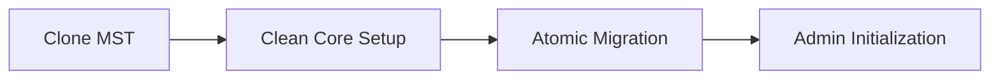
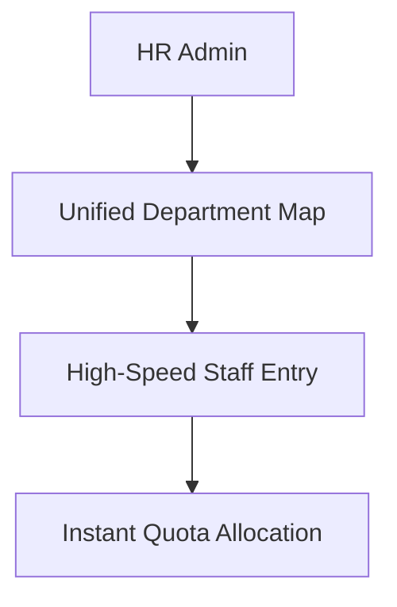
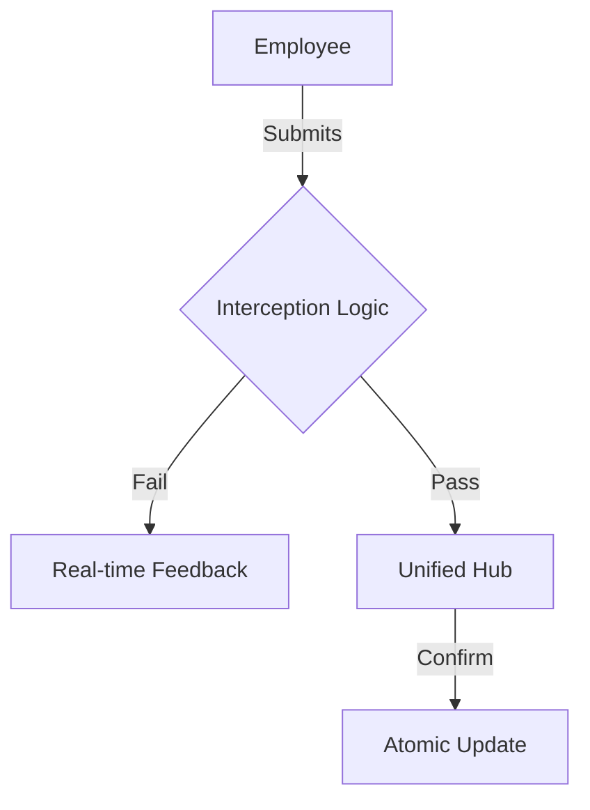

# <div align="center">🌿 Leave Management MST</div>
<p align="center">
  <sub>A Product of <b>ASRS_Empire™</b></sub>
</p>

<p align="center">
  <strong>The Next-Gen, High-Performance Workforce Attendance Ecosystem.</strong>
</p>

<div align="center">

[](https://www.python.org/)
[](https://www.djangoproject.com/)
[](https://github.com/anuragsinghrajsingh/Leave_Management_MST)

</div>

---

<a id="table-of-contents"></a>
## 📑 2. Table of Contents
[🔍 3. About MST Edition](#about-mst)  
[🔄 4. MST Core Flow](#mst-flow)  
[🚀 5. Advanced Features](#advanced-features)  
[🛠️ 6. Tech Stack Details](#tech-stack-details)  
[⚙️ 7. Architecture & Logic](#architecture-logic)  
[📂 8. Project Structure](#project-structure)  
[🏁 9. Getting Started](#getting-started)  
[🔧 10. Configuration & Env](#configuration)  
[🛡️ 11. Security Architecture](#security-architecture)  
[🤝 12. Contribution Guidelines](#contribution-guidelines)  
[❓ 13. FAQ](#faq)  
[🔮 14. Roadmap](#roadmap)  
[📜 15. License](#license)  
[🙏 16. Acknowledgements](#acknowledgements)  
[👤 17. Author](#author)

---

<a id="about-mst"></a>
## 🔍 3. About MST Edition
The **Leave Management MST (Modern System Technologies)** Edition is a complete reimagining of workforce logistics. While maintaining the core reliability of the suite, the MST version focuses on **High-Performance rendering**, **Minimalist Architecture**, and a **Premium User Experience**.

### Why MST?
MST was built for organizations that demand speed and superior aesthetics. We have refactored the legacy core, removing over 30 redundant files to create a "Clean Core" system that is faster and easier to maintain.

### 👑 The ASRS_Empire™ Vision
Part of the **ASRS_Empire™** premium software line, MST adheres to the highest standards of code quality and visual design.

---

<a id="mst-flow"></a>
## 🔄 4. MST Core Flow
The MST workflow is optimized for speed and clarity, reducing "Administrative Click-Debt."

### Phase 1: Initiation 🏗️
Rapid deployment using a pre-configured service layer.


### Phase 2: Onboarding 👥
Seamless organizational setup with centralized entitlement profiles.


### Phase 3: The Daily Cycle 🗓️
A high-integrity loop focused on real-time feedback.


---

<a id="advanced-features"></a>
## 🚀 5. Advanced Features

### 📊 The Unified Hub
A single, high-density dashboard that eliminates the need for multiple page navigations. Administrators can resolve the entire organization's requests from one screen.

### 🛡️ Promise-Based Confirmation
MST utilizes a unique JavaScript-driven modal engine. This ensures that every approval or rejection is a deliberate, context-aware action, preventing accidental data changes.

### 🎨 MST Glass UI
A premium design system featuring glassmorphism effects, dynamic HSL gradients, and 300ms micro-animations for a "liquid" user experience.

---

<a id="tech-stack-details"></a>
## 🛠️ 6. Tech Stack Details
- **Backend Core**: Python 3.8+ / Django 4.2 LTS (Clean Core Architecture)
- **Frontend Interactivity**: Asynchronous JavaScript (Promise-Based)
- **Design System**: Master MST CSS (Glassmorphism & HSL-Dynamic)

---

<a id="architecture-logic"></a>
## ⚙️ 7. Architecture & Logic
MST follows a **Service-Oriented Logic** pattern, where core business rules are isolated into reusable services, making the application extremely lightweight and secure.

---

<a id="project-structure"></a>
## 📂 8. Project Structure
```text
├── Leave Management/
│   ├── App/            # 🧠 The Brain: Refactored Modern Logic
│   ├── static/         # 🎨 The Skin: MST Design System
│   └── templates/      # 🖼️ The View: High-Performance Layouts
```

---

<a id="getting-started"></a>
## 🏁 9. Getting Started
1. `git clone https://github.com/anuragsinghrajsingh/Leave_Management_MST.git`
2. `pip install -r requirements.txt`
3. `python manage.py migrate`
4. `python manage.py runserver`

---

<a id="author"></a>
## 👤 17. Author
**Anurag Singh Raj Singh** - [anuragsinghrajsingh@gmail.com](mailto:anuragsinghrajsingh@gmail.com)

---
<div align="center">
  <sub>Engineering the Future of Work. Powered by <b>ASRS_Empire™</b>.</sub>
</div>
