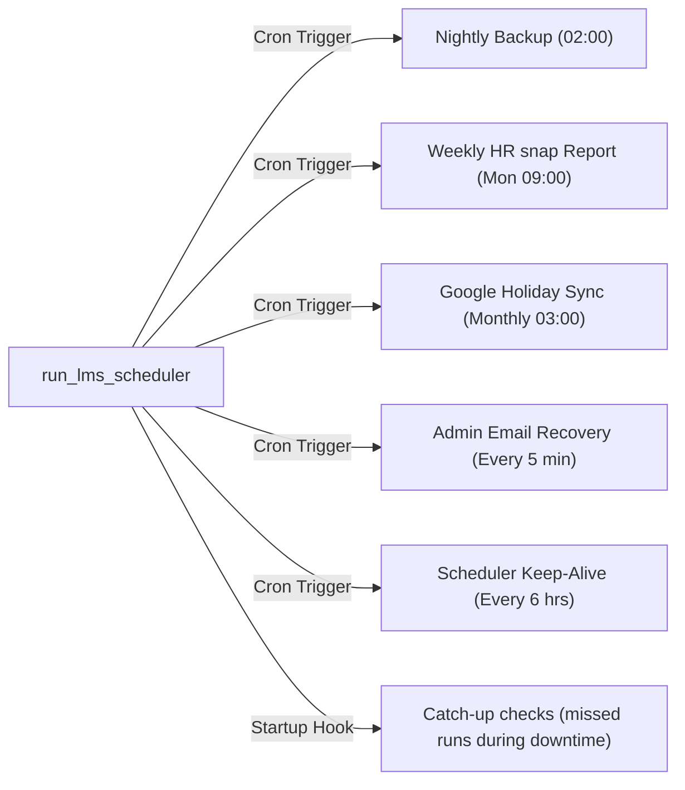
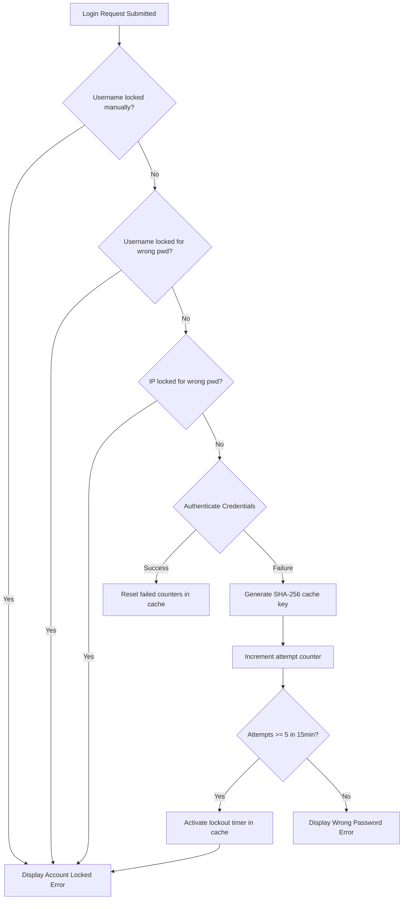
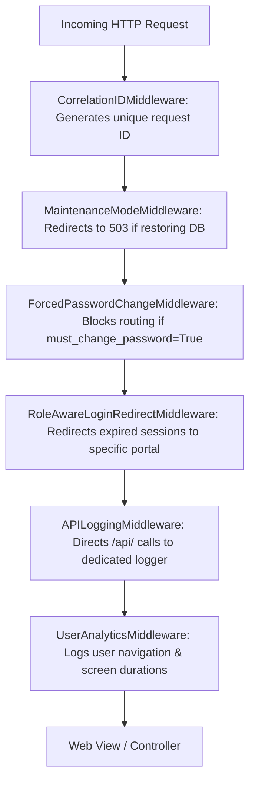
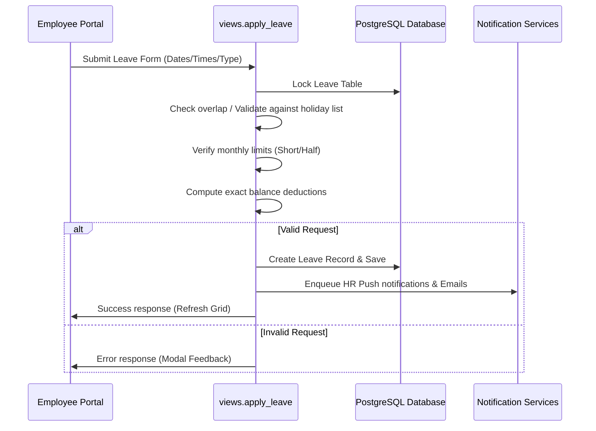
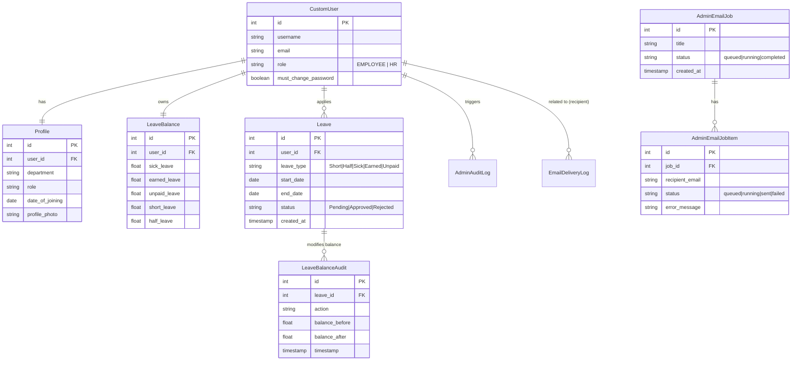

# <div align="center">🌿 Leave Management MST</div>
<p align="center">
  <sub>A Product of <b>MS Technology</b></sub>
</p>

<p align="center">
  <strong>The Next-Gen, High-Performance Workforce Attendance Ecosystem.</strong>
</p>

<div align="center">

[](https://www.python.org/)
[](https://www.djangoproject.com/)
[](https://www.postgresql.org/)
[](https://github.com/anuragsinghrajsingh/Leave_Management_MST)

</div>

---

## 📖 1. Project Overview

The **Leave Management MST (Modern System Technologies)** Edition is an enterprise-grade, high-performance web platform designed to streamline workforce logistics, leave tracking, and communication. Built on top of a highly optimized Django core, this product eliminates legacy technical debt, reduces database locks, implements robust background task queues, and hosts a dedicated scheduler daemon to automate critical business operations.

---

## 📑 2. Table of Contents
1. [🔍 About MST Edition](#about-mst)
2. [🗺️ Living Documentation Map](#documentation-map)
3. [⚙️ System Architecture & Process Shapes](#system-architecture)
4. [🚀 Enterprise Features & Business Rules](#enterprise-features)
5. [🛡️ Custom Middleware Stack & Request Lifecycle](#custom-middleware)
6. [🛠️ Interactive CLI Administration Utilities](#cli-utilities)
7. [📊 Built-in Report Export Engine](#report-engine)
8. [⚓ Django Signals & Event Hooks](#signals-hooks)
9. [🔄 Core System Flowcharts](#system-workflows)
10. [📂 Database Schema & Entity Relationships](#database-schema)
11. [📂 Directory Structure](#directory-structure)
12. [🏁 Getting Started (Local Setup & Testing)](#getting-started)
13. [🔧 Environment Configuration & Secrets](#environment-configuration)
14. [🛡️ Production Deployment & Systemd Setup](#production-deployment)
15. [📈 Operations & Troubleshooting Cheatsheet](#operations-cheatsheet)
16. [🗺️ Complete Routing, Features & File Maps](#routing-feature-maps)
17. [⚖️ Dev vs Production Reference Matrix](#dev-vs-prod)
18. [📜 License & Credits](#license)

---

<a id="about-mst"></a>
## 🔍 3. About MST Edition

The MST Edition was engineered around a **"Clean Core"** philosophy—refactoring legacy structures, removing redundant assets, and separating critical business logic into isolated service files.

### 👑 The MS Technology Pillars
* **Reliability**: Fully atomic transactions, explicit database locking, and background recovery cron jobs guarantee data integrity under peak load.
* **Aesthetics**: A premium modern design language featuring Glassmorphism, dynamic HSL colors, responsive layouts, and 300ms transition animations.
* **Maintainability**: Clear division of concerns. Controllers (views) invoke atomic services rather than executing complex SQL queries directly.

---

<a id="documentation-map"></a>
## 🗺️ 4. Living Documentation Map

This repository is not just application code; it includes a complete operations and deployment manual. Refer to these files when maintaining or updating the system:

| File | Purpose |
|---|---|
| `PROJECT_START_HERE.md` | First file to open. Contains a quick memory map, CLI commands, and directory navigation. |
| `PROJECT_GUIDE.md` | Practical feature guide: roles, workflows, backend services, admin tools, and logs. |
| `PROJECT_DEPLOYMENT_GUIDE.md` | Production manual: systemd units, Gunicorn sockets, nginx proxies, static/media assets, and backups. |
| `PROJECT_DEEP_DIVE_BOOK.md` | Long technical book containing specific file/function references and deep-dive debugging notes. |
| `Leave Management/App/management/production_setup/README.md` | Production secrets generation setup scripts. |

---

<a id="system-architecture"></a>
## ⚙️ 5. System Architecture & Process Shapes

```mermaid
flowchart TB
    Client[Web Browsers / HTTPS] <--> Nginx[Nginx Reverse Proxy]
    Nginx <--> Gunicorn[Gunicorn WSGI Server]
    Gunicorn <--> Django[Django Core Application]
    
    subgraph Services [Asynchronous Processing Engine]
        Django <--> QCluster[Django-Q Cluster / Worker Pool]
        QCluster -- Fallback -- > ThreadPool[ThreadPoolExecutor max_workers=8]
        LMS_Scheduler[LMS Scheduler Daemon] -- Cron Triggers --> Django
    end

    subgraph Database [Storage Layer]
        Django <--> PostgreSQL[(PostgreSQL Database)]
        PostgreSQL -- select_for_update of='self' --> Django
    end

    subgraph FileSystem [State & Backups]
        LMS_Scheduler -- pg_dump --> ZIP[Compressed ZIP Backups]
        Django -- Write --> Logs[System Logs & Startup State]
    end
```

### Process & Worker Configuration
* **Gunicorn**: 1 master process + 3 worker processes.
* **qcluster**: 6 processes total (1 parent, 1 guard, 1 monitor, 1 pusher, 2 task workers).
* **lms_scheduler**: 1 scheduler process running APScheduler.
* **Nginx**: Serves as the HTTPS terminator, static files server, and media assets server.

---

<a id="enterprise-features"></a>
## 🚀 6. Enterprise Features & Business Rules

### 1. Dedicated LMS Scheduler Daemon
A standalone, foreground-safe scheduler CLI daemon command (`python manage.py run_lms_scheduler`) configured with signal handlers (`SIGTERM` / `SIGINT`) to ensure graceful shutdowns. 



### 2. Detailed Leave Rules & Calculation Engine
Calculates exact leave deductions spanning WFH bridges, public holidays, and weekend overrides.
* **Short Leave**: Same day only, max 2 hours, working hours only (10:00 - 19:00), max 2 per month, deducts 0.25 days.
* **Half Leave**: Same day only, max 4 hours, working hours only, max 1 per month, deducts 0.5 days.
* **Full-Day Leaves (Sick, Earned, Unpaid)**: Spans multiple days.

#### Configuration Timing Parameters:
* `SHORT_HALF_LEAVE_MIN_NOTICE_MINUTES` (Default: 15): Lead time required to submit short/half leaves.
* `SHORT_HALF_LEAVE_GRACE_MINUTES` (Default: 5): Submission grace period.
* `SICK_LEAVE_SAME_DAY_CUTOFF_TIME` (Default: "11:59"): The cutoff time (11:59 AM) after which same-day sick leaves are blocked.

### 3. Asynchronous Email & Notification Cluster
Processes bulk administrator onboarding, password changes, welcome packages, and status reminders.
* **ORM Job Queueing**: Jobs are split into `AdminEmailJob` and `AdminEmailJobItem` records.
* **Auto-Recovery**: Recovers items stuck in `running` state for $> 15$ minutes, resetting their state to `queued`.

### 4. Browser Push Notifications (Web Push)
Browser notifications are delivered via service worker subscriptions and VAPID key pairs.
* **Security Note**: Production push notifications require valid HTTPS certificates and explicit user browser permission.
* **Location of Keys**: Configured in `.env` utilizing key paths:
  ```env
  WEB_PUSH_VAPID_PUBLIC_KEY=replace-with-real-public-key
  WEB_PUSH_VAPID_PRIVATE_KEY=runtime/webpush_private_key.pem
  WEB_PUSH_VAPID_SUBJECT=mailto:admin@example.com
  ```

### 5. PostgreSQL Deadlock Mitigation
Critical state transitions (Approve, Reject, Apply, Delete) utilize Django's `select_for_update(of=("self",))` row-locking API. This locks only the target row inside the `Leave` table, allowing related `User` and `Profile` tables to remain readable, completely eliminating PostgreSQL lock contention and deadlock conditions.

### 6. Uptime Tracking Service
Saves app process startup time to `runtime/app_startup.json` for both Gunicorn web server and LMS scheduler processes separately. It handles checks via `uptime_tracker.py` and exposes system uptime on custom admin screens.

### 7. Advanced Security & SHA-256 Hashed Login Lockouts
Provides robust denial-of-service protection against password brute-forcing.



* **Cryptographic Cache Tokens**: Cache keys are generated using SHA-256 hashing to hide usernames and IP addresses in the cache database:
  ```text
  Cache Key = login_rate:{portal}:{kind}:{SHA-256(value)}
  ```
* **Lockout Configurations**:
  * **Admin**: 5 failed attempts in 15 minutes $\rightarrow$ 30-minute lockout.
  * **HR**: 5 failed attempts in 15 minutes $\rightarrow$ 15-minute lockout.
  * **Employee**: 5 failed attempts in 15 minutes $\rightarrow$ 15-minute lockout.

---

<a id="custom-middleware"></a>
## 🛡️ 7. Custom Middleware Stack & Request Lifecycle

The application implements a series of custom middlewares to enforce security boundaries, track user telemetry, manage system maintenance, and correlate requests.



### Middleware Pipeline Descriptions:
1. **`CorrelationIDMiddleware`**: Generates a unique UUID thread-local correlation ID (e.g., `LMS-XXXX`) for every request. Listens for `403 Forbidden` status codes and logs security violations to the `lms_security` logger.
2. **`MaintenanceModeMiddleware`**: Detects if a restore is in progress. Blocks all normal traffic and redirects to a custom `maintenance.html` (503 Service Unavailable), allowing only administrative (`/admin/`, `/admin-login/`) paths and static assets.
3. **`ForcedPasswordChangeMiddleware`**: If the user has the `must_change_password` flag enabled, they are restricted from accessing any routes other than `/force-password-change/` and logout pages.
4. **`RoleAwareLoginRedirectMiddleware`**: Ensures expired or unauthorized user sessions are redirected back to their specific login gateways (e.g., `/employee-login/form/` vs `/hr-login/form/`), displaying a customized pre-filled session expiration notification.
5. **`APILoggingMiddleware`**: Intercepts paths starting with `/api/` and routes performance metrics to the `lms_api` logging file.
6. **`UserAnalyticsMiddleware`**: Measures user transitions between pages, calculating the exact time spent on screens and writing analytics telemetry to `lms_analytics`.
7. **`SuppressNoiseFilter`**: Suppresses frequent background notification polling routes (e.g., `/api/hr-notifications/`, `/api/communications/seen/`) from polluting system log files.

---

<a id="cli-utilities"></a>
## 🛠️ 8. Interactive CLI Administration Utilities

The project includes built-in terminal consoles that developers and system administrators can execute directly:

### 1. Interactive Maintenance Mode CLI
Allows manual toggle of the application maintenance mode via file flags.
* **Command**:
  ```bash
  python "Leave Management/App/services/maintenance_mode.py" [status|enable|disable]
  ```
* **Production Passphrase Confirmation**: In production, the utility requests a case-sensitive confirmation string before changing state:
  * To enable: `PRODUCTION_ENABLE_MAINTENANCE`
  * To disable: `PRODUCTION_DISABLE_MAINTENANCE`
* **Log Output**: Toggles are audited inside the `lms_maintenance` log.

### 2. Interactive Email Delivery Log Auditor
Provides a command-line interface to search, audit, and inspect database records of system-sent emails.
* **Command**:
  ```bash
  python "Leave Management/App/services/email_delivery_log.py"
  ```

---

<a id="report-engine"></a>
## 📊 9. Built-in Report Export Engine

The project hosts a structured data reporting engine (`App/services/report_export_service.py`) that exports 16 report types:

### Supported Reports:
1. **`employee_master`**: Department groupings, profile cards, active statuses.
2. **`leave_request`**: Applied, approved, rejected, and pending leave history.
3. **`leave_balance`**: Remaining leave credits.
4. **`leave_balance_audit`**: Audit trail of manual leave additions/subtractions.
5. **`admin_audit`**: Action log of operations performed from the admin console.
6. **`delete_audit`**: Trace of deleted users and removed leave requests.
7. **`communication`**: Broadcast announcements and direct messages.
8. **`communication_read_seen`**: Telemetry tracking read/seen statuses of messages.
9. **`leave_notification_read_seen`**: Telemetry tracking leave status alerts.
10. **`email_delivery`**: Delivery statuses, smtp errors, and target paths.
11. **`holiday`**: Configuration dates and weekend calendars.
12. **`wfh_rules`**: Work-from-home setups.
13. **`year_end`**: Logs of carry-forward actions.
14. **`service_audit`**: Database backup/restore audits.
15. **`system_health_snapshot`**: Process uptime, db latency, average approval speeds.
16. **`hr_summary`**: Weekly aggregate statistics.

---

<a id="signals-hooks"></a>
## ⚓ 10. Django Signals & Event Hooks

The system utilizes Django signals to automatically maintain state and write security logs:

### 1. Database Creation Hook (`db_signals.py`)
* Automatically creates a `LeaveBalance` and `Profile` record when a new `User` account is registered.
* Synchronizes user roles between `User` and `Profile` tables on updates.

### 2. Authentication Logging Hook (`logging_signals.py`)
* **`user_logged_in`**: Writes a log on successful logins.
* **`user_logged_out`**: Writes a log on logouts.
* **`user_login_failed`**: Logs failed logins with raw attempted credentials (unmasked, per system audit specs) and the attacker's IP.

---

<a id="system-workflows"></a>
## 🔄 11. Core System Flowcharts

### Leave Application & Impact Validation Flow


---

<a id="database-schema"></a>
## 📂 12. Database Schema & Entity Relationships

The following entity-relationship diagram maps out the database architecture of the Leave Management system, showing user metadata, leaves tracking tables, bulk mailers, and logs:



---

<a id="directory-structure"></a>
## 📂 13. Directory Structure

```text
├── Leave Management/
│   ├── App/
│   │   ├── management/
│   │   │   └── commands/
│   │   │       └── run_lms_scheduler.py   # Dedicated Scheduler CLI Daemon
│   │   ├── services/
│   │   │   ├── scheduler.py               # APScheduler Core Configuration
│   │   │   ├── startup_checks.py          # Missed task checks & startup routines
│   │   │   ├── admin_bulk_email_jobs.py   # Async bulk mail & recovery logic
│   │   │   ├── background_tasks.py        # Django-Q & ThreadPool task executor
│   │   │   ├── uptime_tracker.py          # Localized uptime recording
│   │   │   └── public_holidays.py         # Google Holiday Calendar synchronization
│   │   ├── scripts/
│   │   │   └── validators.py              # Max password validator rules
│   │   ├── middleware.py                  # Security & session tracking middleware
│   │   ├── models.py                      # Core Database Schemas
│   │   ├── admin.py                       # Custom Django Admin views & bulk actions
│   │   └── views.py                       # Web View Controllers (Employee/HR/Portal)
│   ├── leave_management/
│   │   ├── settings.py                    # Django configuration (settings, Q_CLUSTER)
│   │   └── urls.py                        # Central routing index
│   ├── static/                            # Front-End design assets (CSS, JS)
│   ├── templates/                         # HTML Templates (Glass UI components)
│   └── manage_backups.py                  # Database Backup & Restore Utility
├── backups/                               # PostgreSQL Compressed Backups (.zip)
├── logs/                                  # System Runtime log files
└── runtime/                               # Runtime state files (app_startup.json)
```

---

<a id="getting-started"></a>
## 🏁 14. Getting Started (Local Setup & Testing)

### Prerequisites
* Python 3.8 or higher
* PostgreSQL 12+ (or SQLite for light development)
* Virtual Environment utility (`virtualenv` / `venv`)

### Setup Steps
1. **Clone the Repository**:
   ```bash
   git clone https://github.com/anuragsinghrajsingh/Leave_Management_MST.git
   cd Leave_Management_MST
   ```

2. **Initialize and Activate Virtual Environment**:
   ```bash
   python -m venv venv
   # Windows PowerShell:
   .\venv\Scripts\Activate.ps1
   # Linux/macOS:
   source venv/bin/activate
   ```

3. **Install Dependencies**:
   ```bash
   pip install -r "Leave Management/requirements.txt"
   ```

4. **Setup Environment variables**:
   Create a `.env` file in the project root folder. Reference the [Configuration section](#environment-configuration) below.

5. **Execute Database Migrations**:
   ```bash
   python "Leave Management/manage.py" migrate
   ```

6. **Create a Superuser**:
   ```bash
   python "Leave Management/manage.py" createsuperuser
   ```

7. **Start the Development Servers**:
   Run the web server:
   ```bash
   python "Leave Management/manage.py" runserver
   ```
   Run the task queue (in a separate terminal):
   ```bash
   python "Leave Management/manage.py" qcluster
   ```
   Run the scheduler daemon (in a separate terminal):
   ```bash
   python "Leave Management/manage.py" run_lms_scheduler
   ```

### Running the Test Suite
Validate code changes locally by running the comprehensive unit test suite:
```bash
python "Leave Management/manage.py" test App.tests
```

---

<a id="environment-configuration"></a>
## 🔧 15. Environment Configuration & Secrets

The application uses an environment-driven configuration setup. Create a `.env` file in the root folder with the following variables:

```ini
# Core Django Settings
DJANGO_SECRET_KEY=replace-with-real-random-secret-key
DJANGO_DEBUG=True
DJANGO_ALLOWED_HOSTS=127.0.0.1,localhost
DJANGO_CSRF_TRUSTED_ORIGINS=http://127.0.0.1:8000,http://localhost:8000

# Cookie Security (Production defaults)
DJANGO_CSRF_COOKIE_SECURE=False
DJANGO_SESSION_COOKIE_SECURE=False

# Database Connection Settings
DB_ENGINE=postgresql
DB_NAME=leave_management
DB_USER=leave_user
DB_PASSWORD=replace-this-db-password
DB_HOST=localhost
DB_PORT=5432

# Local development option: Set DB_ENGINE=sqlite to skip PostgreSQL
# DB_ENGINE=sqlite

# Email SMTP Server Configuration
EMAIL_HOST=smtp.gmail.com
EMAIL_PORT=587
EMAIL_USE_TLS=True
EMAIL_USE_SSL=False
EMAIL_HOST_USER=notifications@yourdomain.com
EMAIL_HOST_PASSWORD=your_app_specific_smtp_password
DEFAULT_FROM_EMAIL=Leave Management <notifications@yourdomain.com>
LEAVE_DESK_FROM_EMAIL=notifications@yourdomain.com
LEAVE_RECORD_EMAILS=records@yourdomain.com

# Web Push Keys
WEB_PUSH_VAPID_PUBLIC_KEY=replace-with-real-public-key
WEB_PUSH_VAPID_PRIVATE_KEY=runtime/webpush_private_key.pem
WEB_PUSH_VAPID_SUBJECT=mailto:admin@example.com

# Background Worker Settings
LMS_Q_WORKERS=2
LMS_Q_TIMEOUT=120
LMS_Q_RETRY=300
LMS_Q_QUEUE_LIMIT=100
LMS_Q_BULK=20

# Operational Settings
PORTAL_BASE_URL=http://127.0.0.1:8000
ADMIN_EMAIL=admin@example.com
LMS_SKIP_UPTIME_RECORD=0

# Security Limits
PASSWORD_INPUT_MAX_LENGTH=128
```

> [!WARNING]
> Never commit your local `.env` file or the `runtime/webpush_private_key.pem` key to version control.

---

<a id="production-deployment"></a>
## 🛡️ 16. Production Deployment & Systemd Setup

For production deployments, all background workloads must be managed by the host OS as persistent system services (`systemd`).

### GitHub vs Production Directory Layout
* **GitHub**: Django files live in the directory `Leave Management/`.
* **Production**: The contents of that folder are placed directly under `/home/mstleave/Leave_Management_MST/`.
* **Example path map**:
  * GitHub: `Leave Management/App/views.py`
  * Production: `/home/mstleave/Leave_Management_MST/App/views.py`

### 1. Gunicorn Web Server Service
File: `/etc/systemd/system/gunicorn.service`
```ini
[Unit]
Description=Gunicorn Web App Daemon
After=network.target postgresql.service

[Service]
User=mstleave
WorkingDirectory=/home/mstleave/Leave_Management_MST
Environment="PATH=/home/mstleave/Leave_Management_MST/venv/bin:/usr/local/bin:/usr/bin:/bin"
ExecStart=/home/mstleave/Leave_Management_MST/venv/bin/gunicorn --workers 3 --bind unix:/home/mstleave/Leave_Management_MST/gunicorn.sock leave_management.wsgi:application
Restart=always

[Install]
WantedBy=multi-user.target
```

### 2. Django-Q Background Worker Service
File: `/etc/systemd/system/qcluster.service`
```ini
[Unit]
Description=Django-Q Queue Cluster Daemon
After=network.target postgresql.service

[Service]
User=mstleave
WorkingDirectory=/home/mstleave/Leave_Management_MST
Environment="PATH=/home/mstleave/Leave_Management_MST/venv/bin:/usr/local/bin:/usr/bin:/bin"
ExecStart=/home/mstleave/Leave_Management_MST/venv/bin/python manage.py qcluster
Restart=always

[Install]
WantedBy=multi-user.target
```

### 3. LMS Scheduler Daemon Service
File: `/etc/systemd/system/lms_scheduler.service`
```ini
[Unit]
Description=LMS APScheduler Daemon Process
After=network.target postgresql.service qcluster.service

[Service]
User=mstleave
WorkingDirectory=/home/mstleave/Leave_Management_MST
Environment="PATH=/home/mstleave/Leave_Management_MST/venv/bin:/usr/local/bin:/usr/bin:/bin"
ExecStart=/home/mstleave/Leave_Management_MST/venv/bin/python manage.py run_lms_scheduler
Restart=always

[Install]
WantedBy=multi-user.target
```

---

<a id="operations-cheatsheet"></a>
## 📈 17. Operations & Troubleshooting Cheatsheet

### 1. Log Inspection Commands
View the real-time logging output of your application components:
```bash
# View Gunicorn logs (HTTP layer)
sudo journalctl -u gunicorn -n 100 -f --no-pager

# View Queue cluster logs (Background tasks)
sudo journalctl -u qcluster -n 100 -f --no-pager

# View Scheduler logs (Cron tasks)
sudo journalctl -u lms_scheduler -n 100 -f --no-pager
```

### 2. Live Database Maintenance
Run manual database backups or restorations using the CLI:
```bash
# Run manual database backup
python manage_backups.py --action backup

# Restore database from a compressed backup zip
python manage_backups.py --action restore --file backups/backup_prod_2026-07-08_02-00-00.zip
```

### 3. Debugging Missed Backups & Reports
Check the status of missed cron tasks inside the Django shell:
```bash
python manage.py shell -c "from App.services.startup_checks import get_backup_catchup_status; print(get_backup_catchup_status())"
```

### 4. Production Environment Validation Queries
Execute these shell checks to verify the security and integrity of your production environment:

```bash
# 1. Cookie Security (Should print: True True Lax True in production)
python manage.py shell -c "from django.conf import settings; print(settings.SESSION_COOKIE_SECURE, settings.SESSION_COOKIE_HTTPONLY, settings.SESSION_COOKIE_SAMESITE, settings.CSRF_COOKIE_SECURE)"

# 2. Password Length Policy (Should print: 128 128)
python manage.py shell -c "from django.conf import settings; from App.scripts.validators import get_password_input_max_length; print(settings.PASSWORD_INPUT_MAX_LENGTH, get_password_input_max_length())"

# 3. Path Validation for Service execution (Confirm pg_dump availability)
sudo systemctl show gunicorn -p Environment
```

---

<a id="routing-feature-maps"></a>
## 🗺️ 18. Complete Routing, Features & File Maps

### Detailed Feature Matrix

| Area | Feature | Primary File | Production Runner |
|---|---|---|---|
| Auths | Role selection and login loader screens | `App/views.py`, `static/js/login_form.js` | `gunicorn` |
| Security | Multi-attempt IP/User Lockout | `App/services/login_lock_service.py` | `gunicorn` |
| Security | Password input max length check | `App/scripts/validators.py` | `gunicorn` |
| Middleware| correlation tracking & logs suppression | `App/middleware.py` | `gunicorn` |
| Leave | Short/Half/Sick/Earned/Unpaid calculations | `App/views.py`, `App/models.py` | `gunicorn` |
| HR Dashboard | Employee management & details panel | `templates/manage_all.html`, `App/views.py` | `gunicorn` |
| Admin Emails | Job recovery & live progress tracker | `App/services/admin_bulk_email_jobs.py` | `qcluster` / `lms_scheduler` |
| Web Push | Browser notifications using VAPID keys | `App/services/push_notifications.py` | `qcluster` |
| PDF Reports | HTML to PDF rendering & email attaching | `App/services/weekly_report_service.py` | `lms_scheduler` (Playwright) |
| Uptime | Process initialization timestamps | `App/services/uptime_tracker.py` | `gunicorn` / `lms_scheduler` |

### Complete Routes & Screens Matrix

| Route | Authorized Roles | Screen Purpose |
|---|---|---|
| `/` | Anonymous | Loading splash entry screen |
| `/portal/` | Anonymous | Portal role selector |
| `/employee-login/form/` | Employee | Login form input |
| `/hr-login/form/` | HR | HR login form input |
| `/admin-login/form/` | Admin | Customized Admin login form input |
| `/dashboard/` | Employee | Employee main panel (leave balances & history) |
| `/apply_leave/` | Employee | Submit leave request forms |
| `/my_leave/` | Employee | Edit or delete pending leaves |
| `/force-password-change/` | HR / Employee | Required password reset view |
| `/hr-dashboard/` | HR | HR main analytics metrics |
| `/manage-all/` | HR | Approve/Reject leave list |
| `/employees/` | HR | Create new employee profile cards |
| `/reports/` | HR | Visual snapshots and weekly reports download |
| `/admin/` | Admin | Django administrator system console |

---

<a id="dev-vs-prod"></a>
## ⚖️ 19. Dev vs Production Reference Matrix

| Area | Local Development | Production Environment |
|---|---|---|
| **Static Files** | Served automatically from Django static files | Compiled using `collectstatic` and served directly by Nginx |
| **Media Files** | Stored locally and served by Django in DEBUG | Served by Nginx from the `/media/` folder |
| **Database** | SQLite (or local PostgreSQL) | Production PostgreSQL (optimized pools) |
| **Scheduled Jobs**| Simulated run | Managed by `lms_scheduler.service` |
| **Backups** | Local script triggers | APScheduler trigger executing `pg_dump` |
| **Web Push** | Works on localhost without SSL | Requires valid SSL/HTTPS domains |

---

<a id="license"></a>
## 📜 20. License & Credits

* **License**: Proprietary - All Rights Reserved. Created as part of the **MS Technology** workforce productivity suite.
* **Author**: Anurag Singh Raj Singh ([anuragsinghrajsingh@gmail.com](mailto:anuragsinghrajsingh@gmail.com))
* **Copyright**: &copy; 2026 MS Technology. Engineering the Future of Work.
